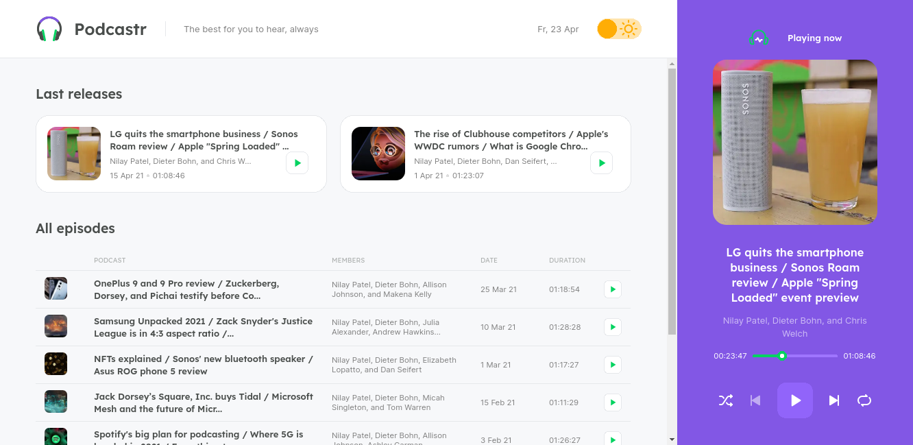
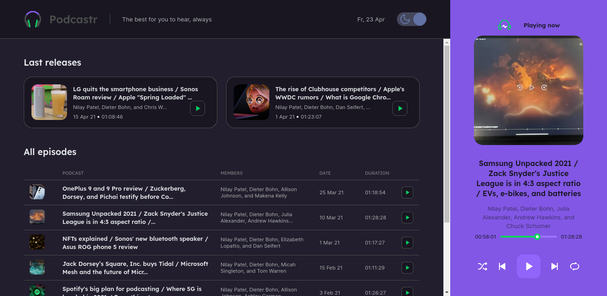
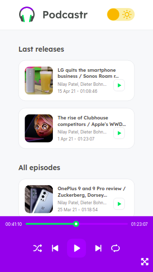
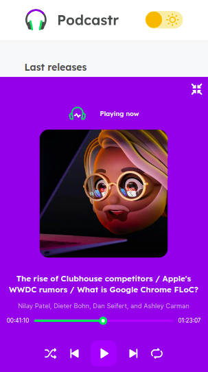

# Podcastr | NLW #5
This is a podcast streaming website developed during the 5th edition of the **Next Level Week**, a coding event organized by [Rocketseat](https://rocketseat.com.br). The website is available at [podcastr.iago-mendes.me](https://podcastr.iago-mendes.me).

## Images
<code>
	
	
	

		
		
	

</code>

## Features
- Listen to a podcast or to a list of podcasts
- Play/pause, play next, play previous, loop, shuffle
- Theme switcher (light or dark)

## Technologies
- [JavaScript](https://www.javascript.com)
- [TypeScript](https://www.typescriptlang.org)
- [React.js](https://reactjs.org)
- [Next.js](https://nextjs.org)
- [Sass](https://sass-lang.com)